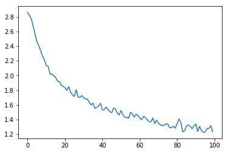

# Classifying-names-using-char-level
We will be building and training a basic character-level RNN to classify words. A character-level RNN reads words as a series of characters - outputting a prediction and “hidden state” at each step, feeding its previous hidden state into each next step. We take the final prediction to be the output, i.e. which class the word belongs to.

<h2>Model Architecture</h2>

<h2>loss</h2>

